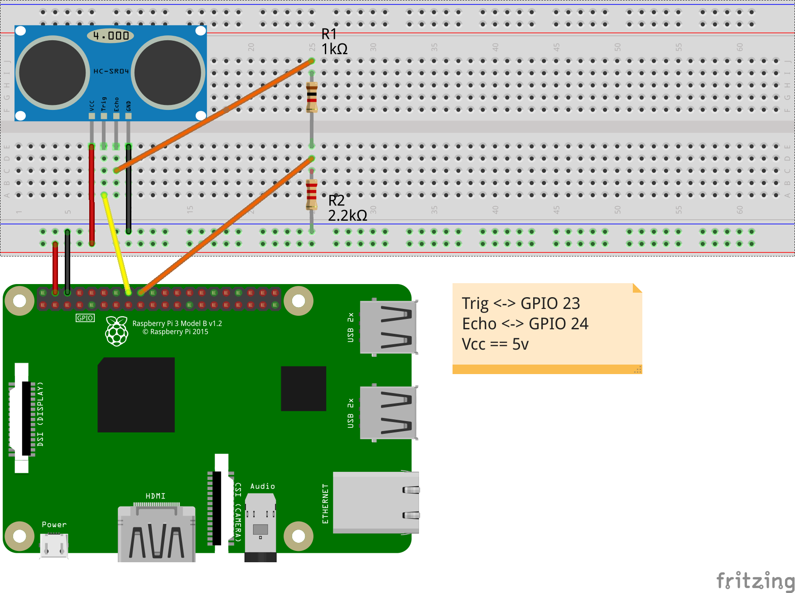

### Sonar with Raspberry Pi

There are many components that allow a robot to *see* its environment including [cameras](https://www.open-electronics.org/computer-vision-with-raspberry-pi-and-the-camera-pi-module/), [optical sensors](https://www.sparkfun.com/products/12728), and [physical sensors](https://www.sparkfun.com/categories/80). These, though, are not nearly as useful as [sonic based imaging](https://en.wikipedia.org/wiki/Sonar) for most applications.

This code works with a [HC-SR04](https://www.sparkfun.com/products/13959) sensor to blast out an sonic signal and wait for its echo. An experimentally determined coefficient is used to convert the delay between sound blast and received echo into meaningful units (here centimeters).

##### Installation
Ensure you have the standard Raspberry Pi GPIO libraries, up to date.

```
sudo apt-get upgrade
```

### Code
```python
#standard imported libraries
import RPi.GPIO as GPIO
import time

#set pinout mode
GPIO.setmode(GPIO.BCM)

#pinout
TRIG = 23
ECHO = 24

#pin direction
GPIO.setup(TRIG,GPIO.OUT)
GPIO.setup(ECHO,GPIO.IN)

#Make sure the output pin is set to low
GPIO.output(TRIG, False)

#let sensor calibrate, it's noisy in the beginning
print "Waiting For Sensor To Settle"
time.sleep(2)

#turn on a very short sonar blast
GPIO.output(TRIG, True)
time.sleep(0.00001)
GPIO.output(TRIG, False)

#we have yet to see the sonar bounce back...
while GPIO.input(ECHO)==0:
  pulse_start = time.time()

#the sonar bounced back!
while GPIO.input(ECHO)==1:
  pulse_end = time.time()

#how long did it take to bounce back?
pulse_duration = pulse_end - pulse_start

#coefficient based on centimeters
distance = pulse_duration * 17150

#make things more human readable
distance = round(distance, 2)

#print result
print("Distance: " + str(distance) + "cm")

#reset pins to their original state
GPIO.cleanup()
```

### Wiring


