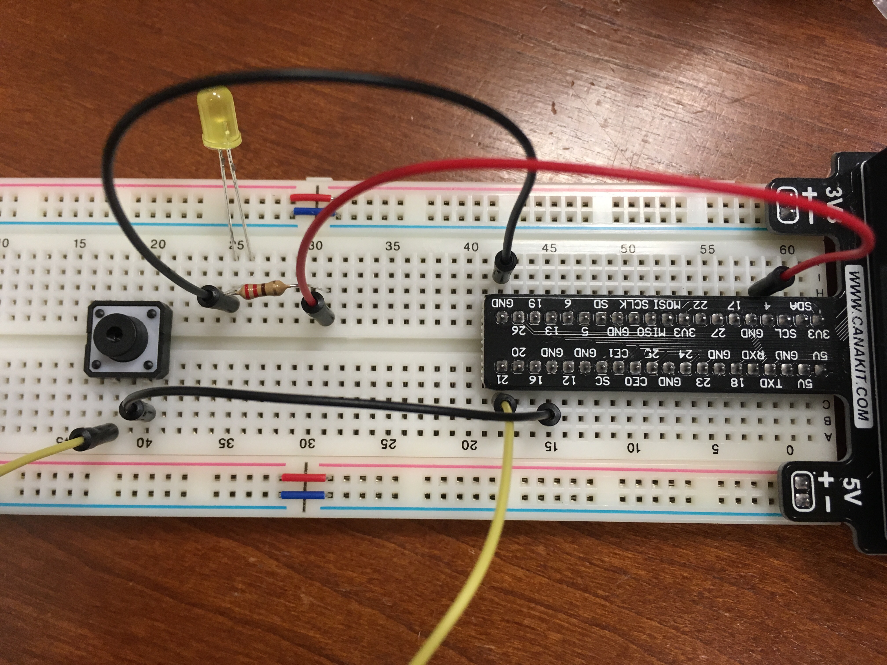

### Turn on and off an LED on pin 4
```
#import necessary libraries
import RPi.GPIO as GPIO
import time

#make our pins behave as expected
GPIO.setmode(GPIO.BCM)

#disable needless warnings about GPIO misuse
GPIO.setwarnings(False)

#make sure the pin 'one-way-streets' run the right direction
GPIO.setup(4,GPIO.OUT)

#turn on the led and print a notification
print "LED on"
GPIO.output(4,GPIO.HIGH)
time.sleep(1)

#turn off the led and print a notification
print "LED off"
GPIO.output(4,GPIO.LOW)
```

### Check for button press on pin 21
```
#import necessary libraries
import RPi.GPIO as GPIO
import time

#make our pins behave as expected
GPIO.setmode(GPIO.BCM)

#disable needless warnings about GPIO misuse
GPIO.setwarnings(False)

#make sure the pin 'one-way-streets' run the right direction
GPIO.setup(21, GPIO.IN, pull_up_down=GPIO.PUD_UP)

#run forever
while True:
    input_state = GPIO.input(21) #check the state of pin 18
    if input_state == False:
        print('Button Pressed')
        time.sleep(0.5) #delay a bit
```




### Bonus: RGB Common Cathode LED on Pins 12, 16, 21

```
import RPi.GPIO as GPIO
import time

rPin = 12
gPin = 16
bPin = 20
 
GPIO.setmode(GPIO.BCM)
GPIO.setup(rPin, GPIO.OUT)
GPIO.setup(gPin, GPIO.OUT)
GPIO.setup(bPin, GPIO.OUT)

freq = 100

red = GPIO.PWM(rPin,freq)
red.start(0)
green = GPIO.PWM(gPin,freq)
green.start(0)
blue = GPIO.PWM(bPin,freq)
blue.start(0)

count = "up"

while count == "up" :
	for i in range(1,100):
		red.ChangeDutyCycle(i)
		time.sleep(.1)
	count = "down"

while count == "down" :
        for i in range(1,100):
                red.ChangeDutyCycle(100 - i)
                time.sleep(.1)
        count = "up"
```
