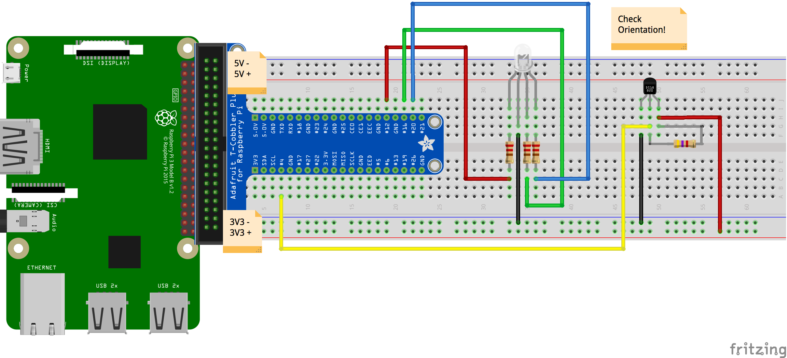

### RGB Common Cathode LED on Pins 12, 16, 21

```
#necessary dependencies
import RPi.GPIO as GPIO
import time

#pin layouts for common cathode RGB LED
rPin = 12
gPin = 16
bPin = 20
 
#set 'one-way streets' to run away from the RasPi
GPIO.setmode(GPIO.BCM)
GPIO.setup(rPin, GPIO.OUT)
GPIO.setup(gPin, GPIO.OUT)
GPIO.setup(bPin, GPIO.OUT)

#variable for frequency
freq = 100

#set the used GPIO pins to PWM mode at 100hz
red = GPIO.PWM(rPin,freq)
red.start(0)
green = GPIO.PWM(gPin,freq)
green.start(0)
blue = GPIO.PWM(bPin,freq)
blue.start(0)

#variable to hold the state of the leds -- increasing or decreasing in brightness
count = "up"

#loop forever
while True :
 #check if the led should be increasing in brightness
 if count == "up" :
  print("ascending")
  #increment the red pin all the way up to full intensity
  for i in range(1,100):
   red.ChangeDutyCycle(i)
   time.sleep(.1)
  #set the flag to decrease the brightness of the leds after fully illuminating
  count = "down"

 elif count == "down" :
  print("descending")
  for i in range(1,100):
   red.ChangeDutyCycle(100 - i)
   time.sleep(.1)
  count = "up"
```

### DS18B20 Temperature Sensor on Pin 4 

Install the [necessary library](https://github.com/timofurrer/w1thermsensor) in your terminal for both Python 2 and Python 3.

```
sudo apt-get install python3-w1thermsensor
sudo apt-get install python-w1thermsensor
```
Visit the Raspberry Menu -> Preferences -> Raspberry Pi Configuration. Under "Interfaces," set `1-Wire` to `Enable`.

In Python, we can now do the following.

```
#import the newly installed library
import RPi.GPIO as GPIO
import time
from w1thermsensor import W1ThermSensor

#set a reusable variable to hold the library's utilities
sensor = W1ThermSensor()

#loop forever
while True :
 #access the sensor's reading
 temp_c = sensor.get_temperature()
 #do math to convert to different temp scale
 temp_f = (temp_c * (9/5)) + 32
 #print the result and convert to strings
 print("temperature in celsius: " + str(temp_c) + " | temperature in fahrenheit: " + str(temp_f))
 #wait five seconds between readings
 time.sleep(5)
```


