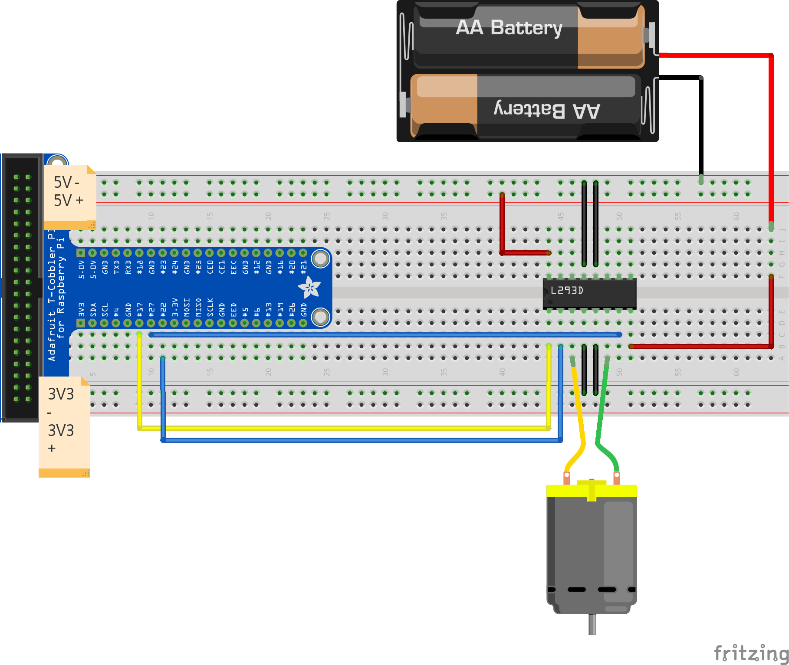
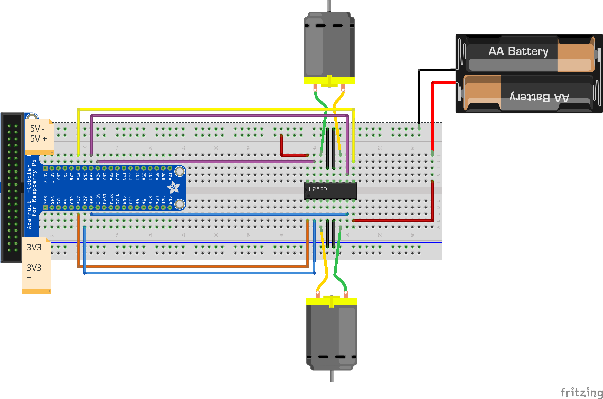

### L293D and Single DC Motor



```
#modules
import RPi.GPIO as GPIO
from time import sleep

#pin layout
GPIO.setmode(GPIO.BCM)

#pin assignments.
MotorA = 27
MotorB = 22
MotorPower = 17

#pin direction
GPIO.setup(MotorA,GPIO.OUT)
GPIO.setup(MotorB,GPIO.OUT)
GPIO.setup(MotorPower,GPIO.OUT)

#PWM cycle frequency
freq = 100

#Startup PWM
motor = GPIO.PWM(MotorPower, freq)
motor.start(0)

print "Going forwards, fast"
GPIO.output(MotorA,GPIO.HIGH)
GPIO.output(MotorB,GPIO.LOW)
motor.ChangeDutyCycle(90)
 
sleep(2)
 
print "Going backwards, slow"
GPIO.output(MotorA,GPIO.LOW)
GPIO.output(MotorB,GPIO.HIGH)
motor.ChangeDutyCycle(50)
 
sleep(2)
 
print "Now stop"
GPIO.output(MotorPower,GPIO.LOW)
 
GPIO.cleanup()
```

### L293D and Dual DC Motors | Extra Challenge!


