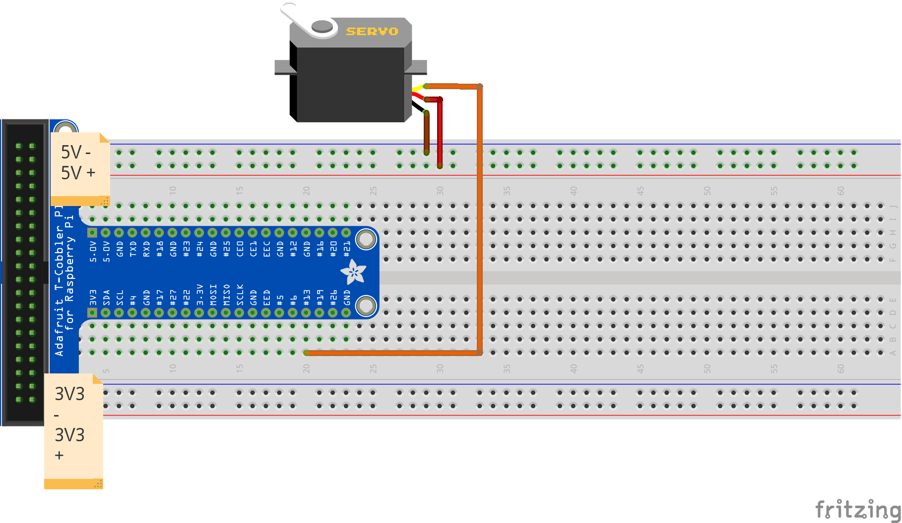

### Servo Control

To drive a [servo](https://en.wikipedia.org/wiki/Servomotor) motor, pulse width modulation is used

Microservers, typically weighing around 10 grams, are able to sweep from 0 to 180 degrees. These microservo motors can travel 90 degrees in .2 seconds, and offer enough torque to keep a small wheel in position. Larger and more expensive servos can sweep 360 degrees.

To drive a servo to a specific position, the following code can be used.

```python
#!/usr/bin/python

#drive a servo to angular position on pin 13

#necessary dependencies
import RPi.GPIO as GPIO
import time
import sys

#disable warnings
GPIO.setwarnings(False)

#pin layout for servo
servoPin = 13

#set 'one-way streets' to run away from the RasPi
GPIO.setmode(GPIO.BCM)
GPIO.setup(servoPin, GPIO.OUT)

#get user input
degree = int(sys.argv[1])

#set PWM frequency
freq = 100

#start up PWM communication
servo = GPIO.PWM(servoPin, freq)
servo.start(0)

#function to return the pulse width necessary 
def angleMap(deg) :
	servoPos =  int( (deg*(19.0/186.0)) + 6 )
	return servoPos

servo.ChangeDutyCycle(angleMap(degree))

time.sleep(1.5)
```


